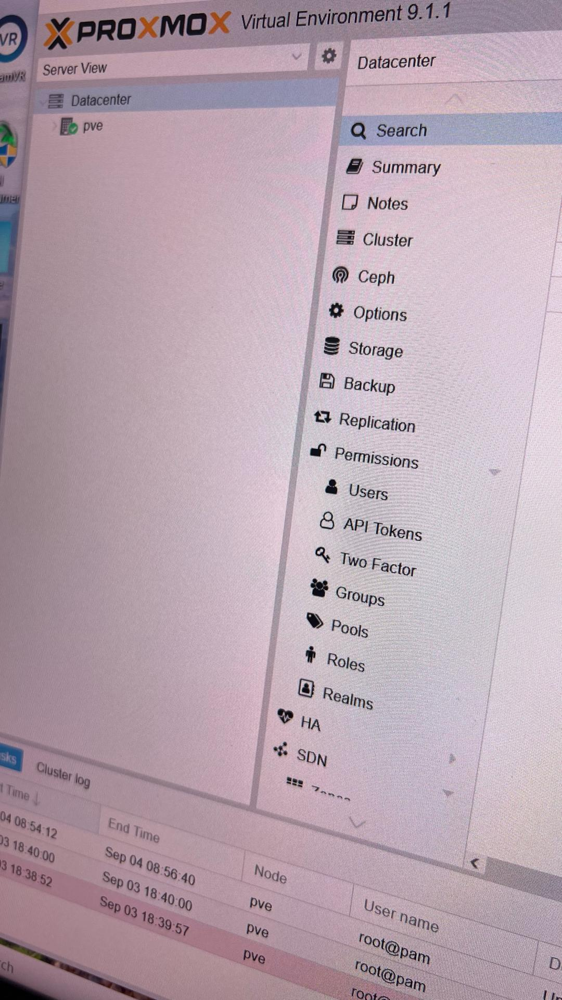
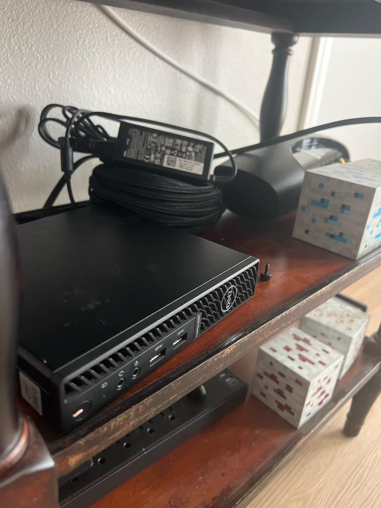

# homelab

A Dell OptiPlex running Proxmox, a Debian VM on top of it, and a language model
served from my house that nothing on the public internet can reach.

No ports are forwarded. There is no reverse proxy, no dynamic DNS, no
`0.0.0.0` bind anywhere in the stack. Every service is reachable from my laptop
in another state and from nowhere else, because the network is private rather
than firewalled.

This is the write-up of how it is built and — more usefully — the six things that
broke and what each one taught me.



---

## What is running

| Host | What it is | Runs |
|---|---|---|
| `pve` | Dell OptiPlex 3080, i5-10500T, 31 GB RAM, Proxmox VE 9.1.1 | the hypervisor |
| `dockerser1` | Debian 13 VM on `pve`, 16 GB / 8 cores | Docker: llama-server, Auto-Clipper AI, Portainer |

Two disks on the VM, and the split matters: a 30 GB root where Docker keeps
`/var/lib/docker`, and a 196 GB data volume. More on why that bit me below.



## The network decision

The usual way to reach a home server from outside is to forward a port on the
router. That publishes a service to the entire internet and makes its
authentication the only thing between strangers and the box.

I used [Tailscale](https://tailscale.com/) instead — a WireGuard mesh where every
device gets a stable private address and can only talk to devices in the same
tailnet. The router forwards nothing. From the internet the house has no open
ports at all.

Two consequences worth stating plainly:

- **Addresses stop moving.** The tailnet address and its MagicDNS name are stable
  regardless of what the ISP does to the WAN IP or DHCP does to the LAN. The
  Proxmox UI lives at one URL forever.
- **Services can be bound narrowly.** Because access control is the network's job,
  a service does not need to listen broadly to be reachable remotely.

The language model is the clearest case. `llama-server` publishes on exactly two
sockets — loopback and the tailnet address:

```yaml
ports:
  - "127.0.0.1:8080:8080"
  - "100.x.x.x:8080:8080"     # tailnet address only
```

Not `0.0.0.0`. It is not on the LAN, not on the IPv6 interface, not on any other
tunnel the box happens to have up. Verified rather than assumed:

```
$ ss -tlnp | grep 8080
LISTEN 0 4096 127.0.0.1:8080   ...
LISTEN 0 4096 100.x.x.x:8080   ...

$ curl 192.168.1.x:8080        # from another machine on the LAN
curl: (7) Failed to connect — Connection refused
```

An open model endpoint with no API key is fine when the network is the
authentication. It would be reckless on `0.0.0.0`.

## Running a language model on it

`llama.cpp` in Docker, OpenAI-compatible API, currently an 8B model at Q5_K_M
quantization (~5.7 GB) on CPU. No GPU in the box.

```yaml
services:
  llama-server:
    image: ghcr.io/ggml-org/llama.cpp:server
    command: >
      -hf bartowski/Dolphin3.0-Llama3.1-8B-GGUF:Q5_K_M
      --host 0.0.0.0 --port 8080
      -c 16384 -t 8 --metrics
    ports:
      - "127.0.0.1:8080:8080"
      - "100.x.x.x:8080:8080"
    mem_limit: 8g
    restart: unless-stopped
```

`--host 0.0.0.0` inside the container is correct — that is the container's own
namespace. The narrowing happens in the `ports` mapping, which is what actually
decides what the host exposes.

Because the API is OpenAI-compatible, anything that speaks that protocol points
at it by changing a base URL. It backs a security-auditing agent that reads logs
on the same network, which is the reason for an uncensored model: a filtered one
refuses to discuss the attack patterns it is supposed to be looking for.

---

## Six things that broke

The setup is the boring part. This is the part I would want to read.

### 1. The CPU the VM had was not the CPU the host had

`llama.cpp` needs AVX2. The build kept refusing to run, and `/proc/cpuinfo`
inside the guest explained why — Proxmox defaults a VM to a *virtual* CPU model
(`x86-64-v2-AES`), which does not expose AVX2 even though the physical i5-10500T
underneath has it.

```
qm set 100 --cpu host
```

Then it still did not work, which was the actually interesting part. A `reboot`
inside the guest does not apply a CPU model change, because the guest never leaves
the same `qemu` process — the emulated hardware is fixed when that process starts.
It needs a cold cycle from the hypervisor:

```
qm shutdown 100 && qm start 100
```

**Lesson:** "restart it" is ambiguous on a VM. Restarting the OS and restarting the
machine are different operations, and anything about emulated hardware needs the
second one. The same trap caught me again later enabling the guest agent.

### 2. Proxmox came back from a power cut. The VM did not.

A power event took the house down. `pve` restored itself and looked healthy.
Docker was unreachable for about two weeks.

The VM's `onboot` flag was unset, so the hypervisor started and simply left the
guest off. Every layer reported itself fine, because every layer *was* fine — the
failure was that nothing owned starting the next layer up.

```
qm set 100 --onboot 1
```

**Lesson:** autostart is not a default, and a healthy hypervisor tells you nothing
about whether the things on it are running. Check recovery by actually cutting
power, not by reasoning about it.

### 3. Locked out of the VM, with no console, no key, and no agent

Recovering from #2 meant logging into a VM whose password I had forgotten, which
had no SSH key installed and no guest agent running. Nothing to talk to.

The hypervisor can edit a guest's disk while the guest is off:

```
apt install libguestfs-tools
qm stop 100
LIBGUESTFS_BACKEND=direct virt-customize -a /dev/pve/vm-100-disk-0 \
  --ssh-inject user:file:/path/to/id_ed25519.pub \
  --password user:password:'<temp>'
qm start 100
```

**Lesson:** on hardware with no BMC or IPMI — which is most consumer hardware —
the hypervisor *is* the out-of-band management path. Worth knowing before you need
it, because you cannot look it up from inside the machine you are locked out of.

### 4. A throwaway container filled the root disk

A `debian:12` container for a tooling experiment grew to 5.47 GB and took `/` to
100%. Builds started failing inside it with errors that had nothing to do with
disk.

The VM has 196 GB free on `/mnt/data`. None of it was in play, because Docker's
`data-root` is `/var/lib/docker` on the **30 GB** root disk. Between the model, a
notebook image, and Auto-Clipper, that disk sits near 85% even when clean.

**Lesson:** know which filesystem your container runtime writes to, and check it
before pulling anything large. The fix is either relocating `data-root` to the
big volume or bind-mounting container storage onto it — space existing on the
machine is not the same as space being available to the thing that needs it.

### 5. `no rules matched`

Remote SSH stopped working. The box was fine: `sshd` bound correctly, the
firewall disabled, `iptables` on ACCEPT. `tailscaled` had the answer in its log:

```
Drop: TCP{laptop > pve:22} no rules matched
```

The tailnet policy was denying it. Tailscale has two policy syntaxes — a legacy
`acls` array and a modern `grants` array — and a policy file is one or the other,
never both. The rule I needed was a grant:

```json
{"src": ["autogroup:member"], "dst": ["*"], "ip": ["*"]}
```

Note that in `grants`, `dst` is hosts or identities and ports live in a separate
`ip` field. Legacy `acls` combines them as `host:port`. Mixing the shapes silently
produces a policy that matches nothing.

**Lesson:** when a connection dies and both endpoints look healthy, something in
between is making a policy decision. Find its log before touching either end.

### 6. The VPN, which took three attempts to diagnose

The worst one. Symptoms: `ping` to a LAN address succeeded, and *every* TCP port
to *every* host — 22, 8000, 8006, 9443 — timed out. Both the VM and the
hypervisor. LAN addresses and tailnet addresses alike.

That signature — ICMP fine, all TCP dead — points at a packet filter, not a route
or a service. It was Mullvad's kill-switch on my laptop, and it defended itself in
layers, each one masking the next:

1. "Allow local network" silently stopped applying after a relay change.
2. Lockdown mode kept blocking after `mullvad disconnect`.
3. Split tunnelling had `ssh.exe` excluded, which *blackholes* SSH specifically
   when the tunnel is down — while ping kept working and kept me looking in the
   wrong place.
4. Residual WFP filters kept blocking LAN TCP even after disconnecting, disabling
   lockdown, and turning split tunnelling off. Only fully quitting the client
   flushed them.

**Lesson:** "ping works but nothing connects" is a filter signature, and on
Windows the filter can outlive the process that installed it. Also: the client
was on the far end of every failed connection and I checked it last. Start with
what changed, not with what is complicated.

---

## What I would do differently

- **Move Docker's `data-root` to the big volume.** #4 is going to happen again
  otherwise; nothing has actually changed.
- **Fix the model cache mount.** The compose file mounts a directory for the
  model, but `-hf` downloads to the HuggingFace cache path instead, so the mount
  is unused and the GGUF lives in the container's writable layer. It survives
  restarts, but a `docker compose up` recreate re-downloads ~5.7 GB.
- **Set BIOS AC recovery to power on.** The OptiPlex has no BMC, so this is a
  physical, at-the-machine change. Until it happens, every power cut needs hands
  on the box.

## Layout

```
llama-server/
  docker-compose.yml    the model server, bound to loopback + tailnet only
docs/                   screenshots
```

Addresses in this repo are placeholders. The architecture is the point; my
particular tailnet addressing is not.
